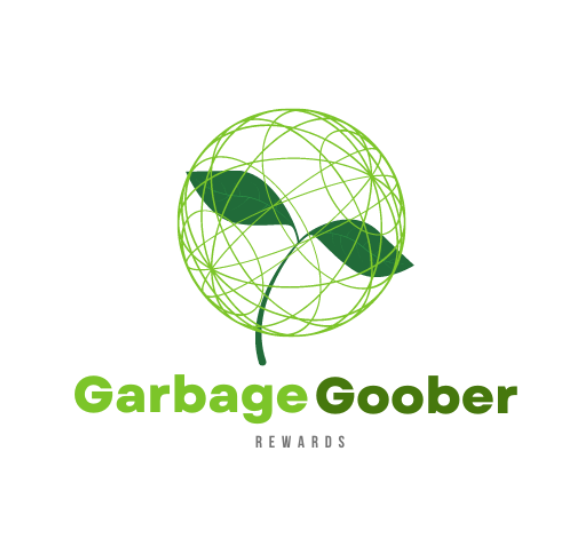

## Getting started

2.  `sudo pip3 install -r requirements.txt`
3.  in Command line: `export FLASK_APP=waste_app.py`
4.  Try: `printenv FLASK_APP`
5.  Output: `waste_app.py`
6. `flask run`

  <h1 align="center">Waste Classification using CNN</h1>

  

    Deep Learning based waste classification system.
     
    <a href="https://github.com/poojitha611/WasteClassification"><strong>Explore the docs »</strong></a>
     
     
    <a href="https://youtu.be/kkXdOf3BB2s">Video Demo</a>
    ·
  
  

# Table of Contents
* [Team Members](#team-members)
* [Inspiration](#a)
* [What it does](#b)
* [How we built it](#c)
* [Challenges](#d)
* [Accomplishments](#e)
# Team Members
* P.Poojitha Chowdary - <marvelmohinish99@gmail.com>
* M. Nikitha - <Jonathangan@usf.edu>

# Inspiration
&nbsp; &nbsp; &nbsp; &nbsp;Landfills are one of the largest producers of Methane and 
house gases. Even power generation from Waste produces CO2. Why is it a big problem? It is because of no proper way in dumping. All kind of wastes are dumped which leads to half degrading and pollution of local resources.Dumping of huge amount of waste also causes soil contamination,Water contamination,Air contamination and causes harm for marine and animal life. 

  
#  What it does
&nbsp; &nbsp; &nbsp; &nbsp;
  - AI/ML      - To determine the type of waste
  - Blockchain - To distribute rewards

We have started out with a flask app for classifying types of waste. Later we decided to implement a better front end experience.

Latest technologies like Deep Learning for Waste classification, web applications ensure the application detects waste correctly.
  <h1>Web App</h1>

  

#  How we built it
&nbsp; &nbsp; &nbsp; &nbsp;We have built this system as Web App. Entire frontend is built using HTML,CSS,JS. 
  
  
| Technology                                 | Uses                                                               |
| ------------------------------------------ | ------------------------------------------------------------------ |
| 1. NFT.storage                             | To store the minted NFT's                                          |
| 2. IPFS                                    | Storage for new images and dataset for Deep Learning model         |
| 3. React Native                            | Mobile App framework                                               |
| 4. Flask                                   | To integrate CNN model to Frontend                                 |
| 5. Filecoin                                | Used in NFT.storage as permanent stoarge platform for minted NFT's |

## Gallery

